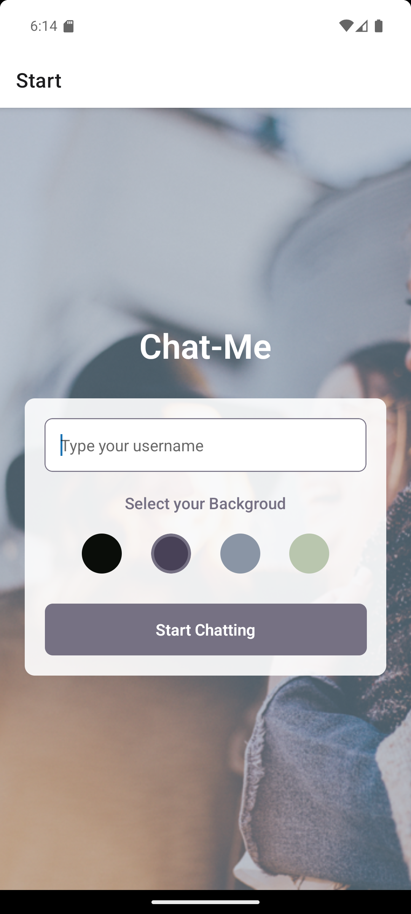
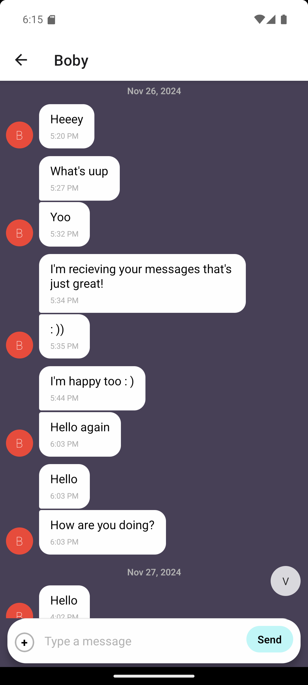
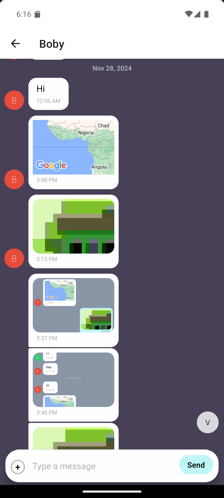

# Chat Me App

A mobile chat application built with React Native and Expo that enables real-time messaging with image sharing and location features.

## Technologies

-   React Native
-   Expo
-   React Navigation
-   Expo ImagePicker
-   Expo Location
-   Google Firebase (Authentication, Firestore, Storage)
-   Gifted Chat Library
-   Android Studio

## Features

-   Custom username input
-   Background color selection
-   Chat interface
-   Navigation between screens
-   Conversation page, input field and submit button
-   Communication features: sending images and location data
-   Data gets stored online and offline

## Installation and Setup

1. Clone the repository

```bash
git clone https://github.com/bob3x/chat-me.git
cd chat-me
```

2. Install dependencies

npm install

3. Create Firebase configuration

-   Create Firebase project
-   Enable Authentication and Firestore
-   Create a `.env` file in the root directory:

````properties
    EXPO_PUBLIC_FIREBASE_API_KEY=your_api_key
    EXPO_PUBLIC_FIREBASE_AUTH_DOMAIN=your_domain
    EXPO_PUBLIC_FIREBASE_PROJECT_ID=your_project_id
    EXPO_PUBLIC_FIREBASE_STORAGE_BUCKET=your_bucket
    EXPO_PUBLIC_FIREBASE_MESSAGING_SENDER_ID=your_sender_id
    EXPO_PUBLIC_FIREBASE_APP_ID=your_app_id

4. Start development server

npx expo start

## Development Requirements
- Node.js
- Expo CLI
- Android Studio (for Android development)
- Xcode (for iOS development)

## Screenshots

<table>
  <tr>
    <td><strong>Start Screen</strong></td>
    <td><strong>Chat Screen</strong></td>
    <td><strong>Image Sharing</strong></td>
  </tr>
  <tr>
    <td>
      
    </td>
    <td>
      
    </td>
    <td>
      
    </td>
  </tr>
</table>

## License

MIT```
````
